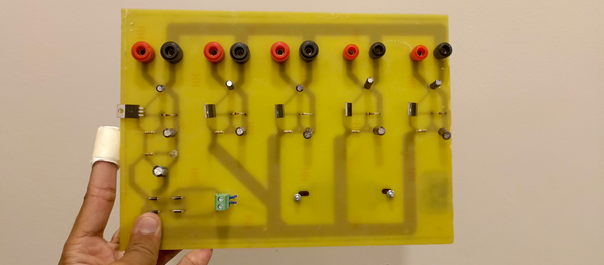
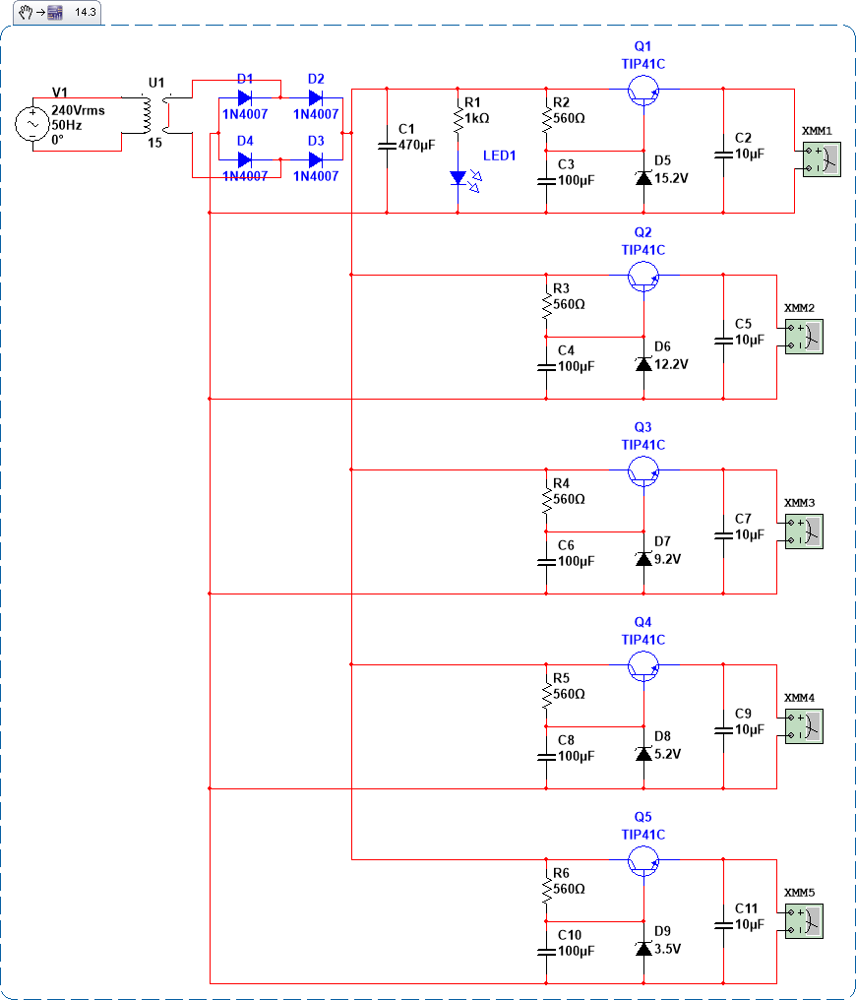
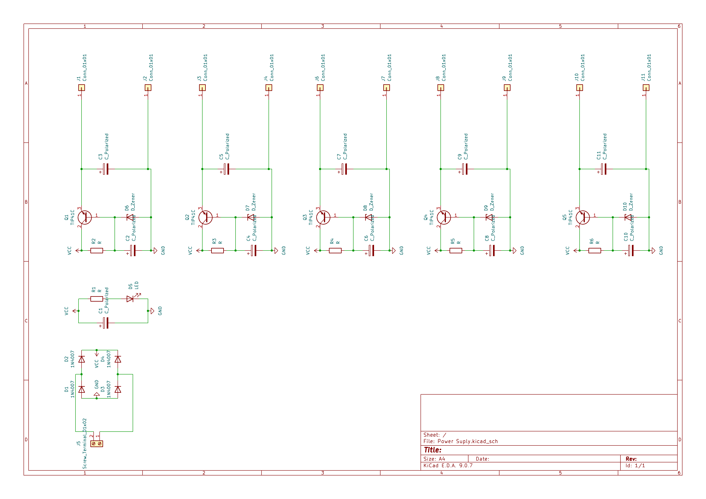
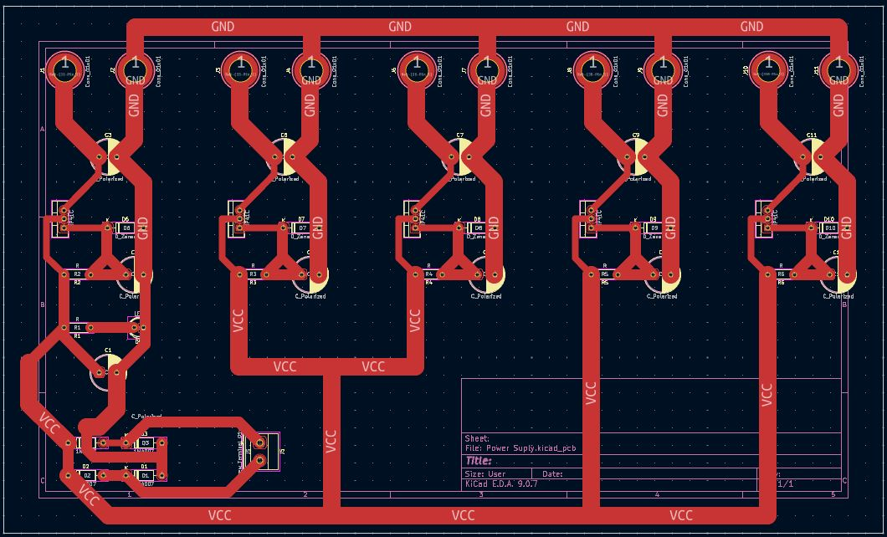

# Discreete Dual Output DC Power Supply
This is a Custom Designed 5 Channel DC power supply that provides 15V, 12V, 9V, 5V and 3.3V outputs.

## Working
The circuit takes AC input from Wall Socket and steps it down to 12V then this AC voltage is rectified be 1N4007 Diodes. This 12V DC voltage then goes to a capacitor which decreases the noise and the voltage goes to about 17V. then this voltage is passed through capacitors and zener diodes to provide the 15V, 12V, 9V, 5V and 3.3V outputs.

## Simulation
This Project is Simulated and Tested in Multisim. It worked fine there and supplied constant voltage under Load.

## PCB and Connections
I designed a Custom PCB for this project.

|Schematics|Tracks|
| :---: | :---: |
|  |  |

## 3D Case

I also designed a 3D enclosure box for the project that would have 11 holes, 1 for input and 10 for the outputs.

|View 1|View 2|
| :---: | :---: |
|  |  |

## BOM

| Name | Purpose | Quantity | Total Cost (USD) | Link | Distributor |
| :---: | :---: | :---: | :---: | :---: | :---: |
| TIP41C | Transistors | 5 | 7 | [TIP41C](https://www.aliexpress.com/item/1005009291854290.html?spm=a2g0o.productlist.main.2.2f5912668WryOQ&algo_pvid=0b7901ac-a991-4423-bff1-2842cce08b4d&algo_exp_id=0b7901ac-a991-4423-bff1-2842cce08b4d-1&pdp_ext_f=%7B%22order%22%3A%223%22%2C%22eval%22%3A%221%22%2C%22fromPage%22%3A%22search%22%7D&pdp_npi=6%40dis%21PKR%212005.10%211963.63%21%21%2143.52%2142.62%21%4021410daa17850251856081765e1e4e%2112000048636612928%21sea%21PK%212961473668%21X%211%210%21n_tag%3A-29919%3Bd%3A7347b7cd%3Bm03_new_user%3A-29895&curPageLogUid=xaTx0ebZWlhw&utparam-url=scene%3Asearch%7Cquery_from%3A%7Cx_object_id%3A1005009291854290%7C_p_origin_prod%3A) | AliExpress |
| Capacitors | Reducing Noise | 11 | 10 |  | AliExpress |
| Resistor | Resistance | 6 | 8 | [Resistor](https://www.aliexpress.com/item/1005006898731441.html?spm=a2g0o.productlist.main.2.5adb174e6BrR4E&algo_pvid=a8b488c6-4e8d-4539-8e68-136df8322c2e&algo_exp_id=a8b488c6-4e8d-4539-8e68-136df8322c2e-1&pdp_ext_f=%7B%22order%22%3A%2218454%22%2C%22spu_best_type%22%3A%22price%22%2C%22eval%22%3A%221%22%2C%22fromPage%22%3A%22search%22%7D&pdp_npi=6%40dis%21PKR%21700.27%21540.04%21%21%2115.19%2111.71%21%40213ba0c517805536286016955e1c85%2112000038655131992%21sea%21PK%212961473668%21X%211%210%21n_tag%3A-29919%3Bd%3A7347b7cd%3Bm03_new_user%3A-29895%3BpisId%3A5000000208499468&curPageLogUid=xK5nH0KMlH7Z&utparam-url=scene%3Asearch%7Cquery_from%3A%7Cx_object_id%3A1005006898731441%7C_p_origin_prod%3A) | AliExpress |
| 12v Transformer | Stepping Down 220V to 12V | 1 | 7 | [12v Transformer](https://www.aliexpress.com/item/1005002190993881.html?spm=a2g0o.productlist.main.3.5ab7c57cYfLk9E&algo_pvid=73899792-524f-4ba5-b0be-0d52e075c67c&algo_exp_id=73899792-524f-4ba5-b0be-0d52e075c67c-2&pdp_ext_f=%7B%22order%22%3A%2269%22%2C%22spu_best_type%22%3A%22price%22%2C%22eval%22%3A%221%22%2C%22fromPage%22%3A%22search%22%7D&pdp_npi=6%40dis%21PKR%212058.51%211933.56%21%21%216.59%216.19%21%40212e520d17805533749515631efcd4%2112000019002828064%21sea%21PK%212961473668%21X%211%210%21n_tag%3A-29919%3Bd%3A7347b7cd%3Bm03_new_user%3A-29895&curPageLogUid=AV8pa8Zxzb4a&utparam-url=scene%3Asearch%7Cquery_from%3A%7Cx_object_id%3A1005002190993881%7C_p_origin_prod%3A) | AliExpress |
| Diode | Rectifier | 1 | 3.6 | [Diode](https://www.aliexpress.com/item/1005012369097375.html?spm=a2g0o.productlist.main.3.e8886f76qmjBun&algo_pvid=c9794048-4184-407d-bd0b-0edbe400970a&algo_exp_id=c9794048-4184-407d-bd0b-0edbe400970a-2&pdp_ext_f=%7B%22order%22%3A%221%22%2C%22eval%22%3A%221%22%2C%22fromPage%22%3A%22search%22%7D&pdp_npi=6%40dis%21PKR%213746.13%211045.14%21%21%2181.26%2122.67%21%40212a70c017805519689011413e223e%2112000058193885987%21sea%21PK%210%21ABX%211%210%21n_tag%3A-29910%3Bd%3A7347b7cd%3Bm03_new_user%3A-29895%3BpisId%3A5000000208221885&curPageLogUid=psqZq8pejmBE&utparam-url=scene%3Asearch%7Cquery_from%3A%7Cx_object_id%3A1005012369097375%7C_p_origin_prod%3A) | AliExpress |
| Zener Diode | Zener Diode | 5 | 15 | [Zener Diode](https://www.aliexpress.com/item/1005010765949748.html?spm=a2g0o.productlist.main.3.547c4dc3FEmVEE&algo_pvid=ed544284-69c7-4d00-983a-87739ac0a65a&algo_exp_id=ed544284-69c7-4d00-983a-87739ac0a65a-2&pdp_ext_f=%7B%22order%22%3A%2211%22%2C%22eval%22%3A%221%22%2C%22fromPage%22%3A%22search%22%7D&pdp_npi=6%40dis%21PKR%218259.05%213964.12%21%21%21179.26%2186.04%21%40210159d417850253732154640e0e3d%2112000053435372829%21sea%21PK%212961473668%21X%211%210%21n_tag%3A-29919%3Bd%3A7347b7cd%3Bm03_new_user%3A-29895&curPageLogUid=iE0PDDcbkAz3&utparam-url=scene%3Asearch%7Cquery_from%3A%7Cx_object_id%3A1005010765949748%7C_p_origin_prod%3A) | AliExpress |
